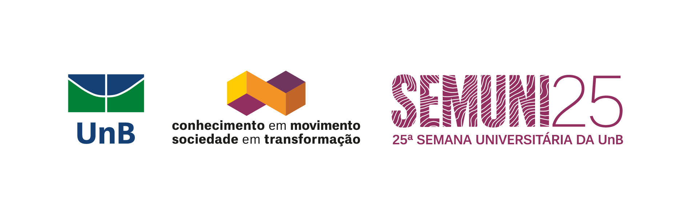

# Introdução a programação de aplicações em nuvem

Bem-vindo ao curso de **Introdução a programação de aplicações em nuvem**! Este curso apresenta uma **visão introdutória sobre as principais tecnologias utilizadas atualmente para o desenvolvimento de aplicações de larga escala em nuvem**.

## Objetivos do Curso

!!! info "Objetivo Geral"
    O objetivo geral dessa oficina/curso é que o aluno **compreenda as principais tecnologias utilizadas para construção de aplicações de larga escala** e aprenda alguns **paradigmas de programação paralela e distribuída**.

### Objetivos Específicos

!!! success "Ao final deste curso, você será capaz de:"
    
    - **Experimentar** a construção de aplicações distribuídas (utilizando linguagem C básica)
    - **Experimentar** a construção de aplicações paralelas, usando os núcleos de processamento dos processadores e GPUs
    - **Conhecer** o Kubernetes como ferramenta de DevOps para desenvolvimento de aplicações distribuídas/paralelas

## Programa do Curso

=== "Módulo 1: Introdução"
    
    - **Visão Geral**: Aplicações e arquiteturas paralelas e distribuídas
    - **Arquiteturas Paralelas**: Conceitos e implementações
    - **Arquiteturas Distribuídas**: Fundamentos e padrões

=== "Módulo 2: Programação Distribuída"
    
    - **MPI**: Message Passing Interface para programação distribuída
    - **Brokers**: Sistemas de mensageria e comunicação
    - **xRPC**: Remote Procedure Calls e protocolos de comunicação

=== "Módulo 3: Programação Paralela"
    
    - **OpenMP**: Programação paralela em memória compartilhada
    - **GPUs**: Computação paralela em placas gráficas
    - **Paralelismo em C**: Implementações práticas usando linguagem C

=== "Módulo 4: Cloud Native & Kubernetes"
    
    - **Cloud Native**: Conceitos e metodologias
    - **Kubernetes**: Orquestração de containers
    - **DevOps**: Kubernetes como ferramenta de DevOps para deploy

## Pré-requisitos

Para aproveitar ao máximo este curso, você precisará de:

1. **Conhecimentos básicos** em programação (especialmente linguagem C)
2. **Familiaridade** com conceitos básicos de sistemas operacionais
3. **Interesse** em tecnologias de alta performance e larga escala

!!! tip "Dica Importante"
    Este curso combina teoria e prática intensiva. Prepare-se para experimentar e implementar aplicações paralelas e distribuídas!

## Resultados Esperados

!!! success "Ao concluir o curso"
    Espera-se que os estudantes saiam com **conhecimento suficiente para se envolverem em projetos que exijam nível mínimo de conhecimento sobre tecnologias voltadas para aplicações de larga escala**.

## Tecnologias e Palavras-Chave

| Categoria | Tecnologias/Conceitos |
|-----------|----------------------|
| **Programação** | C, OpenMP, MPI |
| **Paralelismo** | GPUs, Processamento Multi-core |
| **Distribuição** | Brokers, xRPC, Message Passing |
| **Cloud Native** | Kubernetes, DevOps |
| **Conceitos-Chave** | Programação Paralela, Programação Distribuída |

## Cronograma do Curso

!!! info "Informações Gerais"
    **Período**: 03 a 07 de Novembro de 2025  
    **Modalidade**: Curso intensivo presencial  
    **Local**: Universidade de Brasília

### Cronograma

| Data | Tópico | Duração |
|------|--------|---------|
| **03/11** - **05/11** |  **Apresentação sobre aplicações e arquiteturas paralelas e distribuídas (MPI e OpenMP)** | 3 dias |
| **05/11** |  **Conhecendo GPUs e outros paradigmas de programação paralela** | 1 dia |
| **06/11** - **07/11** |  **Cloud Native e DevOps com Kubernetes** | 2 dias |

## Instrutores

-   :material-account-circle-outline: **Prof. Dr. Fernando William Cruz**

    ---

    { align=left width=80 }

    **Coordenador do Curso**
    Professor da FCTE/UnB

-   :material-account-circle-outline: **Bruno Martins**

    ---

    { align=left width=80 }

    **Membro da Equipe**
    Graduando em Engenharia de Software (FCTE/UnB)  

-   :material-account-circle-outline: **Thiago Vivan**

    ---

    { align=left width=80 }

    **Membro da Equipe**
    Graduando em Engenharia de Software (FCTE/UnB)  

## 📖 Recursos Adicionais

- [OpenMP Documentation](https://www.openmp.org/specifications/)
- [MPI Tutorial](https://mpitutorial.com/)
- [Kubernetes Documentation](https://kubernetes.io/docs/)
- [CUDA Programming Guide](https://docs.nvidia.com/cuda/)

!!! warning "Importante"
    Este é um curso intensivo que requer dedicação para experimentação prática. Certifique-se de ter conhecimentos básicos de programação em C antes de iniciar.

---

**Universidade de Brasília - 2025**
